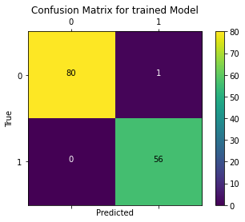
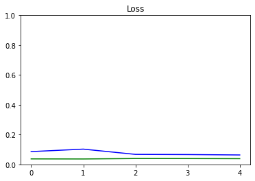

# Breast-cancer-detection-using-neural-network

<!-- TABLE OF CONTENTS -->

  
Table of Contents

  <ol>
    <li>
      <a href="#introduction">Introduction</a>
    </li>
    <li>
      <a href="#tools">Tools</a>
    </li>
    <li><a href="#data">Usage</a></li>
    <li><a href="#methodology">Methodology</a></li>
    <li><a href="#results">Results</a></li>
  </ol>

### Introduction
A neural network was designed to predict whether a tumor is malignant or benign using a given set of tumor properties, such as cell size, thicknes, shape, and others.
The main aim of the model is to use API Tensorflow to build a more advanced custom training scenario. All built in Keras functions of calculating losses, compiling and fitting dataset were replaced by a custom functions written using API Tensorflow. This is helpful to see what's going on under the hood when you're training using Keras. 

### Tools
Python 3, API Tensorflow, Pandas, Numpy

### Data
Breast Cancer Wisconsin Dataset, available at this <a href="https://archive.ics.uci.edu/ml/machine-learning-databases/breast-cancer-wisconsin/">link</a>

It is a structured dataset, represented as a CSV file. It was generated from a close inspection tumor images, which were taken in a biopsy.

### Methodology
A neural network consists of:
- Input layer with a shape of the length of the given properties of the tumor 
- 128 Dense Layer with relu activation
- 64 Dense Layer with relu activation
- 1 Dense Layer with sigmoid activation for classification

### Results
The prediction accuracy of the network on the test dataset is 99.3%. With an average accuracy of 91% and valid accuracy of 96%. The loss chart and the Confusion Matrix of the Model are shown below.

